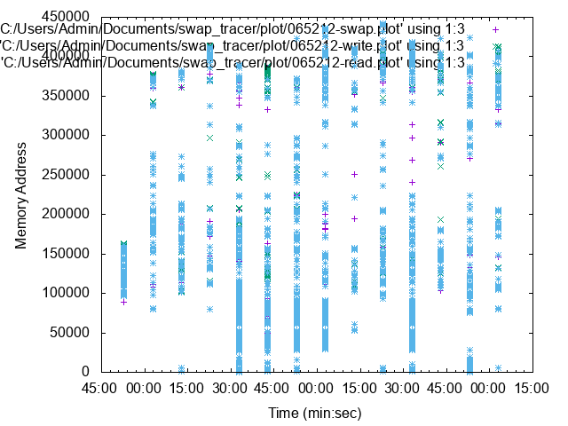
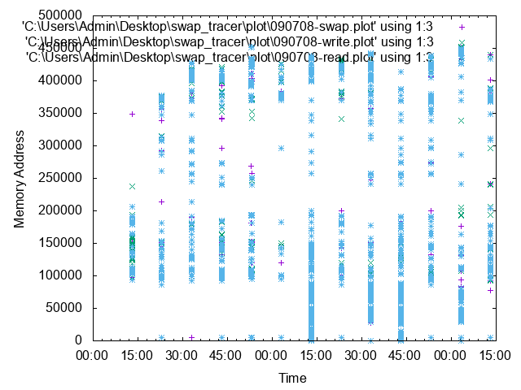
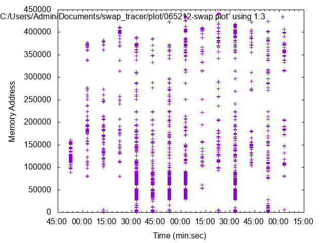

# Swap Tracer


Swap Tracer is an effective tool to visualize the change in memory and analyze it after executing the program.

## Environment/Requirement
+ os : centos 7 ( linux series are available. )
+ kernel : 5.1.14 ( older versions are available also.)  
+ [lazybox](https://github.com/sjp38/lazybox) : work of @sjp38, if needed for the limited memory usage(optional).
+ [gnuplot]() : a visualization tool (optional).

## [Kernel Patch](https://github.com/lynring24/swap_tracer/blob/master/tracer_kernel.patch)
> patch -p0 < tracer_kernel.patch   

In kernel directory adapt patch file. It will add lines to mm/page_io.c and mm/memory.c.

## How To Use
Since there might be a data locality, trace could be done in more abstracted mode with option [-m].

> $ sudo  sh   DIR/swaptracer/run_swap_tracer.sh \[-m\]  \[MEM_LIMIT\] COMMAND     
> ex) sudo  sh run_swap_tracer.sh "python cnn.py"
> ex) sudo  sh  run_swap_tracer.sh   524   "python cnn.py"  
> ex) sudo  sh  run_swap_tracer.sh  -m   256 "python cnn.py"

**sudo**  Tracer reads log file which needs the permission of root.

**-m** option for simpler version, output of the statistical mean value(optional).

**mem limit in MiB** limits the usage of memory. (optional)

**command** programs to be run.


## Result
Three logs will be generated per execution of run_swap_tracer.sh, **read**, **write** and **do_swap**, which will be in a form of array vector to plot to Gnuplot. Comparison of the three logs contains the data pattern of program's memory usage.

#### plot
After the execution, Tracer generates three files in the form **HHMMSS-[read|write|swap].plot**. These files contain rows of [date, time, address].

#### graph
With a gnuplot, Tracer visualizes memory access pattern. X-axis is a timeline of minute and second, while y-axis is a memory address. To use a gnuplot scripts will be as below:
```
load 'DIR/swap_tracer/gnuplot_script'
//data format=yyyy-mm-dd hh:mm:ss
plot 'DIR/swap_tracer/plot/input_data' using 1:3, ['DIR/swap_tracer/plot/file_data' using 1:3]

//if needed for png files
set term png
set ouput 'filenme'
plot 'DIR/swap_tracer/plot/input_data' using 1:3, ['DIR/swap_tracer/plot/file_data' using 1:3]
replot
```

## Experiment
### with CNN model
> conv-->max_pooling-->conv-->maxpooling-->dropout-->dropout

### print read, write, do_swap at once


### print read, write, do_swap at once with '-m' option


### print swap only

