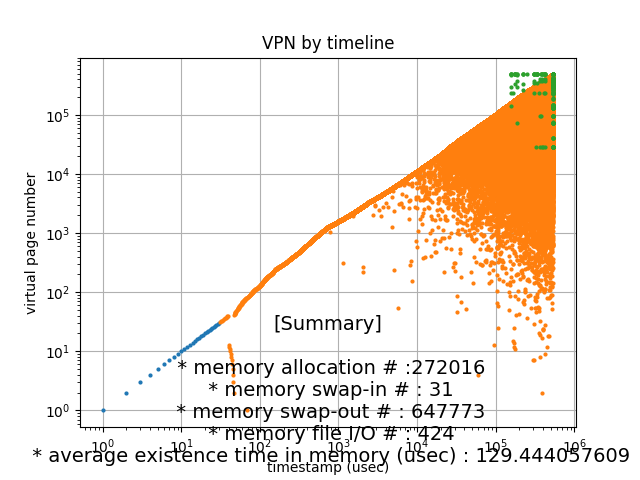

# swptracer


 **swptracer** is an effective tool to visualize the change(swap) in memory and analyze it after executing the program. Currently, swap in/out and do_swap has been marked.

## Environment/Requirement
+ os : centos 7 ( linux series are available. )
+ kernel : 5.1.14 ( older versions are available also.)  
+ python : 2.7.5
+ plotly : for visualization

## [Kernel Patch](https://github.com/lynring24/swptracer/blob/master/tracer_kernel.patch)
> patch -p0 < swptracer.patch   

In kernel directory adapt patch file. It will add lines to mm/page_io.c and mm/memory.c.

## How To Use
### Setup
```
sh setup.sh
```
### run  

```
python $SWPTRACE/exec.py [<Mib> <command>]
# <MiB> and <command> is a quick option for setup. 
```
[optional] 
Before using this swap tracer, modify **driver/configure.json** if needed.
This will be a default setting.``
{
        "MEM_LIMIT": memory limit in MiB,
	"COMMAND": command to run,
	"PATH": {
		"LOG_ROOT": path for log directory 
	},
        "ABSTRACT": option to abstract data using spatial locality (default true),
        "THRESHOLD": user-defined threshold for vma (default -1 if not used), 
        "PATTERN": { // pattern used to parse or extract data
	        "LOG": pattern for log , 
       		"DATE": pattern for date ,
       		"BLOCK": pattern for block,
        	"MICROSEC": pattern for microsec
	},
	"SIZE" : {
        	"BLOCK": a block of log lines,
        	"PAGE": size of vm page (default 4096) 
	}
}
```
###  visualize 
```
python driver/graphic/plot.py LOG_ROOT/YYYY-MM-DDTHH:MM:SS.msec/extract.log
```

### OUTPUT
```
LOG_ROOT
|
| YYYY-MM-DDTHH:MM:SS.msec
          |  awk.log  
          |  extract.log
```
### plot




## Directory 
+ swptracer.patch
+ driver 
+ driver/graphic
+ demo/log
+ demo/code
+ demo/plot

