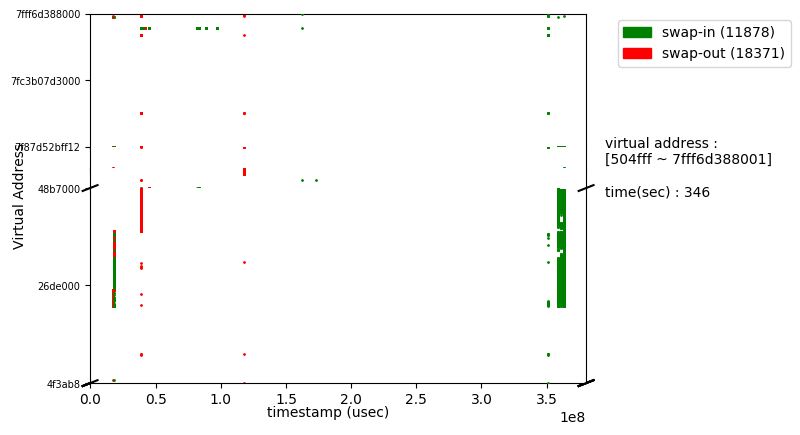
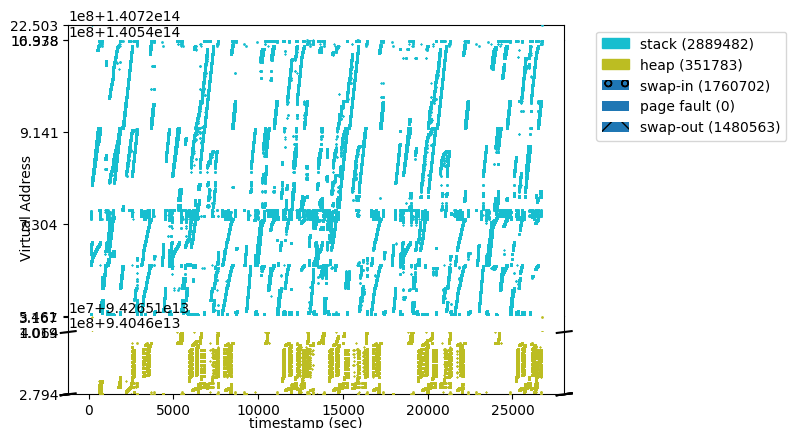
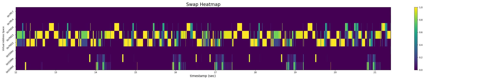

# swptracer


 **swptracer** is an effective tool to visualize the change(swap) in memory and analyze it after executing the program. Memory movement (swap in, out) could be tracked and summarized by swptracer.   

## Environment/Requirement
+ os : centos 7 ( linux series are available. )
+ kernel : 5.1.14 ( older versions are available also.)  
+ python : 2.7.5
+ plotly : for visualization

## [Kernel Patch](https://github.com/lynring24/swptracer/blob/master/tracer_kernel.patch)
> patch -p0 < $SWPTRACE/../swptracer.patch   

In kernel directory adapt patch file. It will add lines to mm/page_io.c and mm/memory.c.

## How To Use
### Setup
1. Disable **/etc/rsyslog.conf** option
```
# Use traditional timestamp format.
# To enable high percision timestamps, comment out the following line
#
# $ActionFileDefaultTemplate RSYSLOG_TraditionalFileFormat <- Here
```
2. Run script and compile  
```
# run setup
$ cd /PATH_TO_SWPTRACER_ROOT/
$ sh setup

# to check setup
$ echo $SWPTRACE
$ source ~/.bashrc

$ cd driver
$ make 

# install requisite package
# python=2.7.*
$ pip install $(cat requisite)
$ apt-get install python-tk
```

### Execution

```
# <> is optional
$ python $SWPTRACE/exec.py <--faault> <--interval=MICROSECOND> "command to run"

# example 
$ python $SWPTRACE/exec.py --faault --interval=1000 "./script.sh"

```

### OUTPUT
```
LOG_ROOT
|
| YYYY-MM-DDTHH:MM:SS.msec
          |  LOG_FILES.csv
```
## Output plots 

### Scatter Plot 
1. Plot with mode option
```
$ python $SWPTRACE/plot.py
```


2. Plot with memory map
```
$ python $SWPTRACE/plot.py -m|--mmap
```


### Heatmap Plot
```
$ python $SWPTRACE/heatmap.py
```


## Directory 
+ patch
+ driver 
+ demo
