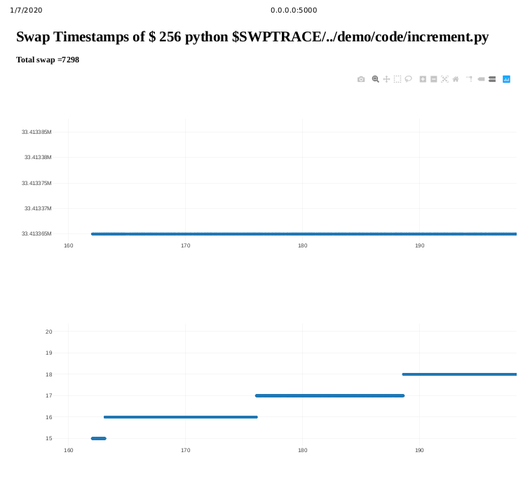

# swptracer


 **swptracer** is an effective tool to visualize the change(swap) in memory and analyze it after executing the program. Currently, swap in/out and do_swap has been marked.

## Environment/Requirement
+ os : centos 7 ( linux series are available. )
+ kernel : 5.1.14 ( older versions are available also.)  
+ python : 2.7.5
+ plotly : for visualization

## [Kernel Patch](https://github.com/lynring24/swptracer/blob/master/tracer_kernel.patch)
> patch -p0 < $SWPTRACE/../swptracer.patch   

In kernel directory adapt patch file. It will add lines to mm/page_io.c and mm/memory.c.

## How To Use
### Setup
```
$ sh setup.sh

# to check setup
$ echo $SWPTRACE
$ source ~/.bashrc

```
#### PATH SETTING 
Before using this swap tracer, modify **driver/configure.json** if needed.
This will be a default setting.

```
{
        "MEM_LIMIT"  : memory limit in MiB,
	"COMMAND"    : command to run,
        "PUBLIC"  : {
              "IP"   : public ip you need,
              "PORT" : port number,
        },
	"PATH": {
		"LOG_ROOT": path for log directory, MUST BE ABSOLUTE PATH 
	}
}
```
### run  

```
$ python $SWPTRACE/exec.py <--mem=Mib> <--cmd="command to run"> <--ip=public ip> <--port=port number> 

# <options> are for quick setup.
```

### OUTPUT
```
LOG_ROOT
|
| YYYY-MM-DDTHH:MM:SS.msec
          |  awk.log  
          |  extracted.log
```
### plot




## Directory 
+ swptracer.patch
+ driver 
+ driver/templates
+ driver/unittest (for checkup)
+ demo/log
+ demo/code
+ demo/plot

