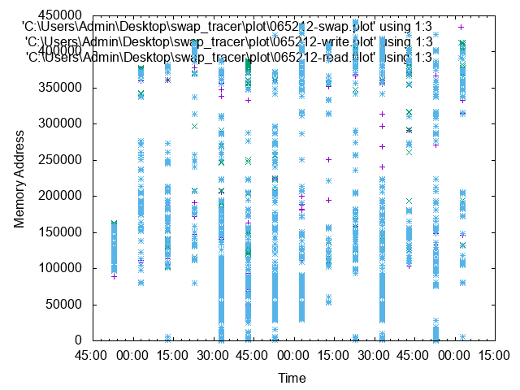

# Swap Tracer

Swap Tracer is an effective tool to visualize the change in memory and analyze it after executing the program.

### Environment/Requirement
+ os : centos 7 ( linux series are available. )
+ kernel : 5.1.14 ( older versions are available also.)  
+ [lazybox](https://github.com/sjp38/lazybox) : work of @sjp38, needed for the limited memory usage.

### Modify Kernel

### How To Use

Since there might be a data locality, trace could be done in more abstracted mode with option [-m].

> $ sudo  sh   DIR/swaptracer/run_swap_tracer.sh -m   MEM_LIMIT COMMAND   
> ex) sudo  sh  run_swap_tracer.sh  -m 50 "python cnn.py"

**sudo**  Tracer reads log file which needs the permission of root.

**mem limit in MiB** limits the usage of memory.

**command** programs to be run.

**-m** option for simpler version, output of the statistical mean value(optional).

### Result
Three logs will be generated per execution of run_swap_tracer.sh, "read", "write" and "swap", which will be in a form of array vector to plot to Gnuplot. Comparison of the three logs contains the data pattern of program's memory usage.

#### Used Model
+ CNN
> conv-->max_pooling-->conv-->maxpooling-->dropout-->dropout

>>>>>>> 921c3be285f52c8cb363ec5c773b52b4ec0b4b84

### Poster

